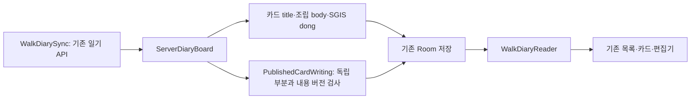

# 독립 카드 작성 결과 연결

DEV의 기존 산책 일기 응답 `walk-diary-board-v1`에 선택 필드 `scenes[].writing`을 추가했다. [DEV 구조와 Mermaid](https://github.com/SAJOYO/DAENGS_dev/blob/feat/diary-card-orchestration/docs/walk/card-orchestration.md)를 기준으로 한다.

공간·조건부 행동 작성 후 DEV가 채택 본문을 고정하고 제목만 별도 작업으로 생성한다. APP는 서버의 카드 `title`을 목록과 상세에서 사용한다. `킁킁` 같은 행동 종류가 카드 제목을 대신하지 않는다. 전체 산책 제목은 이 변경의 대상이 아니다.

DEV의 실행은 기존 `orchestration` 안의 일기 LangGraph로 연결되어 있고, 어시스턴트와 같은 `JobExecutor`를 사용한다. APP의 요청·읽기·Room 저장 경로는 그대로다. 본문·위치는 제목 전에 고정되며, 제목 묶음 일부가 실패해도 성공한 카드 제목과 본문을 유지한다. 제목의 내용 버전에는 별도 보존 원문이 들어가지 않지만, 원문 변경은 서버의 기존 발행 버전 검사와 APP의 사용자 편집 보존 대상이다.

SGIS 정규화의 `sido / sigungu / dong` 중 기존 표시 계약대로 **`dong`만** 시간 옆 위치값에 사용한다. 제목의 표현과 위치 표시가 서로 의존하지 않는다.

`PublishedCardWriting`은 제목이 참조한 내용 버전, 공간/행동 부분과 최종 본문의 일치, 행동핀의 행위자 연결, 원문 보존을 검사한다. 이를 내부 발행 근거로 저장하며 읽기 화면을 별도 칸으로 나누지 않는다. 기존 JSON에 이 필드가 없어도 이전 방식으로 읽는다.

사용자가 수정한 제목·본문은 기존 `StoryboardDraft`가 우선한다. 분리 작성 원본은 과거 공개 근거일 뿐, 사용자 편집 본문을 다시 합성하거나 덮어쓰는 자료가 아니다. API 응답은 기존 `sourcePayload`와 Room 저장 경로를 거치므로 재개방 후에도 그대로 복원된다.

`diary-card-orchestration-v1.json`은 DEV의 실제 HTTP 생성 테스트에서 외부 SGIS·EGIS·LLM만 대체한 응답이다. `PublishedCardWritingTest`와 `WalkDiarySpacePersistenceTest`가 이 응답의 제목·행동 유무·행정동 표시·원문·편집·Room 재개방을 확인한다. 실제 모델 문장 품질을 입증하는 표본은 아니다.
