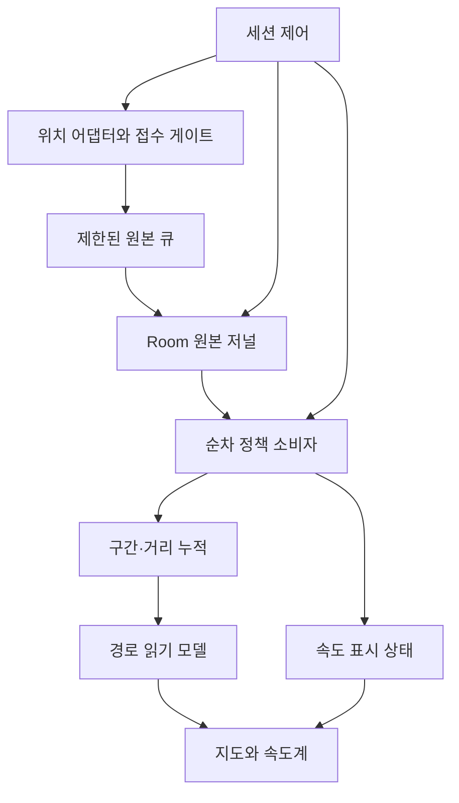

# GPS 위치·이동 정책층 — 1차 설계

상태: **설계 완료 / 구현 전**. 이 문서는 실행 코드 변경이나 실기기 검증 완료를 뜻하지 않는다.

- 대상: SAJOYO/DAENGS_APP, `dev` @ `b95d927f57e0377d2ee40278065703210e5af1d0`
- 확인일: 2026-09-10
- 범위: GPS 수집·원본 저장·이동 정책·표시 상태의 계약과 이행 계획
- 제외: 안내 캐릭터, 서버 정책 통합, 점령 인증 완화, 새 위치 알고리즘의 실측 성능 주장

## 1. 이번에 고정하는 설계

**속도 숫자는 계속 유지하고, 기록 판단은 저장 가능한 원본 근거로 재현한다.** 수신, 영속화, 계산, 표현의 상태를 따로 관리한다.

| 결정 | 규칙 |
| --- | --- |
| 표시 연속성 | 결측마다 숫자를 지우거나 0으로 초기화하지 않는다. 새 세션의 최초 표시는 `0.0` + 측정 전 상태다. |
| 독립적인 품질 | 위치 품질, 속도 근거, 산책 구간 인정, 표시 최신성을 별도로 판단한다. |
| 상태 소유권 | 세션 실행층이 수명과 명령을, 단일 정책 소비자가 이동 상태를, 표시 reducer가 표시 상태를 소유한다. |
| 원본 경로 | 첫 큐 앞에서 번호를 부여한다. 원본에 `conflate`, `collectLatest`, 드롭 정책을 적용하지 않는다. |
| 기본 실행안 | 작은 배치로 저장하고, **별도 정책 소비자**가 저장된 번호를 따라간다. writer는 정책이나 화면 완료를 기다리지 않는다. |
| 종료 경계 | 접수 종료 번호까지 저장·정책 처리·무결성 확인 후 완료를 확정한다. |
| 정책 고정 | 새 정책 세션은 버전과 유효 설정을 시작 시 고정한다. 과거 기록을 조용히 새 기준으로 바꾸지 않는다. |
| 첫 버전의 보류 | 거리의 무기한 PENDING을 도입하지 않는다. 근거 부족 구간은 EXCLUDE + 이유를 남긴다. 추정 상태는 UNKNOWN일 수 있다. |

저장 뒤 계산하는 기본안에는 **저장 지연이 표시 갱신을 늦출 수 있는 비용**이 있다. 먼저 이를 계측한다. 이 비용이 출시 지연 예산을 넘으면 저장 전 잠정 표시안을 별도 설계 변경으로 검토한다. 첫 구현에 두 개의 이동 엔진을 동시에 도입하지 않는다. 이전 숫자를 유지하는 것만으로 실시간성이 충족됐다고 판정하지 않는다.

## 2. 현재 코드에서 확인한 사실

아래는 고정 커밋을 읽은 결과다. 제보 영상 시점의 실제 큐 포화, CPU 병목, OS 공급 중단은 아직 측정하지 않았다.

| 지점 | 현재 동작 | 설계에 반영할 의미 |
| --- | --- | --- |
| `FusedLocationSource.locationUpdates` | main Looper에서 `result.locations`를 순회하고 `trySend` 결과를 무시한다. [S01] | 수신 전용 실행기와 제출 실패 계약 필요 |
| `LocationTracker` | `SharedFlow(extraBufferCapacity=16)`로 전달하고 `stop()`은 수집 job을 취소한다. generation은 상태 갱신에 사용된다. [S02] | 관측 자체에 epoch가 없고 drain 완료 계약도 없다. 기존 동시성 장치가 없다는 뜻은 아니다. |
| `WalkTrackingService` | Main.immediate에서 위치·제어 처리. 서비스에 도착한 뒤 `clientSeq`를 증가시키고 writer에 먼저 제출한 다음 경로를 계산한다. [S03] | 첫 전달 큐에서 빠진 관측은 현재 번호로 추적 불가. 저장 완료 전에 화면 계산이 진행되는 현 구조와 새 기본안의 지연 차이를 측정해야 한다. |
| `WalkFixWriter` / `DaengsApp` | Application의 IO scope에서 무제한 명령 큐를 순차 소비. `flush`는 앞선 명령의 성공/실패 종료를 기다린다. [S04][S05] | flush는 이미 writer에 제출한 작업의 장벽이다. 위치 수신 버퍼까지 비우는 장벽은 아니다. |
| `WalkSpeedometer` | 이미 마지막 숫자와 최초 `0.0`을 `rememberSaveable`로 유지한다. 속도 유효성에 따라 표시등 상태는 즉시 바뀐다. [S06] | 숫자 유지 기능을 새로 발명하는 작업이 아니다. 상태를 세션으로 옮기고 표시등 전환도 안정화한다. |
| `WalkScreen` | 화면 타이머로 `walkGaugeSpeed`를 호출하고 가로·세로 배치에서 속도계를 별도 위치에 구성한다. [S07] | 화면 구성과 무관한 표시 상태가 필요하다. 현재 화면 전환이 실제 제보 원인인지는 미확인이다. |
| `TrailRecorder` | 정확도·최소 이동·고속 제외·점프·경로·거리·최대 5,000점 보관을 함께 처리. snapshot 시 목록을 복사한다. [S08] | 정책 계산과 지도 보관·발행 비용 분리. 오래된 표시점 제거는 원본 삭제와 다르다. |
| `WalkPace` | 기기 속도를 우선 사용하고, 없으면 마지막으로 **인정한 점**과 벽시계 차이로 계산한다. [S09] | 최근 관측 이력과 거리 기준점 분리. 단조 시각과 속도 품질 필드 필요 |
| `RecordedFix` / `WalkFixRow` | 속도, 속도 정확도, 단조 시각, 수신 시각이 저장되지 않는다. [S10][S11] | 저장 전후 입력이 같지 않으므로 같은 계산기를 호출하는 것만으로 재현성을 보장할 수 없다. |
| `summarize` | 저장 fix를 현재 `TrailRecorder`로 재생. 기기 속도 없이 좌표 기반 판단을 사용한다. 활동 시간도 원본 fix의 chain 내 간격으로 계산한다. [S12] | 실시간과 종료 후 거리·시간 계약을 함께 다뤄야 한다. |
| 종료와 후속 작업 | tracker 취소 → 핀 종료 예약 → 세션 close → writer flush → 요약 판정. Room close는 일기 준비와도 연결된다. [S03][S13][S14] | 최종 close를 앞당기면 일기·동기화 복구가 불완전한 세션을 집을 수 있다. |

현재 속도계의 숫자 유지 테스트도 존재한다. 이번 작업에서는 테스트 코드를 읽었으며 실행하지 않았다. [S15]

### 2.1 설계상 구분해야 할 재현 사례

현재 `TrailRecorder`는 고속 점을 제외해도 그 이유만으로 `breakBeforeNext`를 설정하지 않는다. 다음 점의 기기 속도가 낮으면 마지막 인정 점과 다시 연결할 수 있다. [S08][S09]

예를 들어 정확도 조건이 모두 유효한 입력을 다음과 같이 가정하자.

| 측정 시각 | 직선상 위치 | 기기 속도 | 현재 실시간 판단의 가능 결과 |
| --- | --- | --- | --- |
| 0초 | 0m | 0m/s | 첫 점 |
| 1초 | 10m | 10m/s | 7m/s 초과로 제외 |
| 2초 | 20m | 0m/s | 현재 속도가 낮으므로 0m 지점과 연결, 20m 합산 |

이는 코드 조건을 적용한 **설명용 반례**이며 실제 단말 측정 결과가 아니다. 같은 위치를 저장 후 재생하면 기기 속도가 없어 좌표 기반 속도 판정으로 다른 결과가 나올 수 있다. 새 설계는 고속 제외 뒤 연결 장벽을 유지해 이 구간을 다시 산책 거리로 붙이지 않는다.

## 3. 실행 구조와 클래스 대응

`motion`은 우선 앱 안의 Kotlin 패키지로 둔다. 별도 서버나 Gradle 모듈은 필요하지 않다.



저장 완료 알림은 최신 진행 번호만 합쳐도 된다. 정책 소비자는 그 번호 사이의 **모든 저널 항목**을 페이지로 읽는다. 알림 하나가 GPS 한 점을 대체하지 않는다.

| 기존 요소 | 목표 책임 / 제안 파일 | 이행 방식 |
| --- | --- | --- |
| `LocationSource` / `FusedLocationSource` | `location` 어댑터, `walk/runtime/WalkIngress` | 일반 지도 조회 계약은 유지. 산책 연속 구독에 접수 번호·epoch·닫기 응답 추가 |
| `LocationTracker` | 일반 화면 위치 구독 | 산책의 신뢰성 있는 원본 통로에서는 SharedFlow 중계를 제거하고 전용 입구를 사용 |
| `WalkTrackingService` | FGS 권한·알림·명령 어댑터 | 계산·큐 소유를 `WalkSessionRuntime`에 위임. 알림 등 Android 작업만 Main에서 수행 |
| `WalkRuntime` / `DaengsApp` | 런타임 조립·프로세스 수명 | 세션 실행 scope와 IO writer·정책 소비자 연결. Application 수명은 프로세스 사망 내구성을 뜻하지 않음 |
| `WalkFixWriter` | `RawJournalWriter` | 임의 suspend 작업 큐에서 원본·제어·저널 트랜잭션의 명시적 명령으로 축소 |
| `WalkFixLog` / Room | `ObservationJournal` 인터페이스 | 원본·제어 사건·진행 정보의 페이지 조회와 멱등 append 제공 |
| `WalkPace` / `TrailRecorder` | `walk/motion/MotionEstimator`, `SegmentPolicy`, `MotionPolicyEngine` | 속도·구간 판단을 이동. 지도 점 보관은 `TrailProjection`으로 분리 |
| `walkGaugeSpeed` / 속도계의 remember | `walk/motion/MotionDisplayReducer` | 표시 최신성·숫자 유지·근거 상태를 런타임에서 계산 |
| `WalkTrackingStore` | 최신 불변 `WalkTrackingState` | `motionDisplay`, `recordingHealth`, 경로 revision을 제공 |
| `WalkViewModel` / `WalkLocationCoordinator` | 화면 구독 조정·카메라 | 기록 중 서비스 위치를 쓰는 기존 소유권 유지. 화면의 새 좌표 조회를 기록 입력으로 주입하지 않음 [S16] |
| `WalkStylePolicy` | 눈금·색상·테마 | 산책 인정 상한과 분리. 경로 색상은 구간 속도, 속도계는 표시 속도를 소비 [S17] |
| `summarize` / `WalkSessionRoute` | 저장된 정책 버전으로 만든 읽기 모델 | 새 세션은 같은 원본·제어 사건·정책으로 재생. 시각화를 위해 다시 속도를 추정해 인정 여부를 바꾸지 않음 |
| `StayStampRecorder` / 행동 핀 | 별도 기능 소비자 | 원본 참조·구간 단절을 이용하되 독립 계산을 수신/writer 대기열에 오래 묶지 않음 |

첫 구현에서 이동 정책 결과를 행동 핀 위치나 현장 인증으로 자동 승격하지 않는다. 기존 행동 원본과 추정 핀의 구분을 보존한다. [S18]

## 4. 데이터 계약

아래 이름은 제안이며 구현된 API가 아니다. 좌표는 위경도, 거리는 m, 속도는 m/s, 단조 시각은 ns로 통일한다.

### 4.1 원본과 식별자

| 계약 / 필드 | 의미와 불변 조건 |
| --- | --- |
| `SessionPolicy` | `sessionId, ownerId, policyVersion, effectiveConfig, configHash, observationSchemaVersion`. 시작 후 계산 설정 고정 |
| `RawObservation` 식별 | `sessionId, sourceEpoch, clockEpochId, ingressSeq, batchId, batchIndex` |
| `ingressSeq: Long` | 세션 내 첫 접수 게이트에서 0부터 부여. 큐 제출 실패에도 소비된 번호를 되감거나 재사용하지 않음 |
| `sourceEpoch` | 구독을 새로 열 때마다 새 식별자. pause/resume, 재구독, 복구 경계를 구분 |
| `clockEpochId` | 단조 시각을 비교할 수 있는 영역. 초기 구현은 런타임 재생성마다 새 식별자를 쓰고 경계를 넘는 차이를 계산하지 않음 |
| 측정 시각 | `observedWallMillis, observedElapsedNanos?`. 원본 보존. 새로운 정상 Android 관측의 단조 시각 결손은 진단 대상 |
| 수신 시각 | `receivedElapsedNanos, receivedWallMillis`. 처리 시각으로 측정 시각을 덮지 않음 |
| 위치·속도 | `latitude, longitude, horizontalAccuracyM?, deviceSpeedMps?, speedAccuracyMps?` |
| 출처 | `provider?, platformMock, emulatorEvidence, isMock`. 기존 mock 보호를 유지하고 입력의 출처와 파생 결론 구분 |
| 방향 | 기존 `bearingDegrees?, bearingAccuracyDegrees?`를 유지. 속도계 값으로 방향을 생성하지 않음 |
| `ReceiptOutcome` | `PERSISTED, INGRESS_REJECTED, STORAGE_FAILED`와 이유. 정책 제외와 구분 |
| `ControlRecord` | `controlId, type, boundaryElapsedNanos, boundaryWallMillis, sourceEpoch, afterIngressSeq` |
| `JournalEntry` | 원본·구간 개폐·알려진 누락 범위를 재생할 순서인 `journalSeq`. GPS 번호와 제어 사건 번호를 혼용하지 않음 |

Android는 속도 존재 여부와 속도 정확도 존재 여부를 따로 제공한다. 위치 정확도를 속도 정확도로 대신하지 않는다. 단조 시각은 같은 비교 영역에서만 사용한다. [Android Location][A01]

`clientSeq`는 현재 핀 참조·서버 전달에서 사용하므로 이번 설계로 타입이나 의미를 바로 바꾸지 않는다. 후속 로컬 스키마에는 `ingressSeq`와 기존 `clientSeq`의 매핑을 보존한다. 정책 처리 순서는 ingress/journal 번호를 쓰고, 기존 전송 계약은 별도 어댑터를 쓴다. 기존 행을 다시 번호 매기지 않는다.

### 4.2 추정·구간·표시 결과

| 계약 | 필수 내용 |
| --- | --- |
| `MotionEstimate` | 기준 observationRef, `positionQuality`, `speedMps?`, `speedSource`, `speedQuality`, lastValidObservedNanos, reasons |
| `speedSource` | `DEVICE / COORDINATE_WINDOW / UNKNOWN`. 표시값 유지와 구분 |
| `SegmentDecision` | `segmentId, fromRef?, toRef, distanceUse, distanceDeltaM, connection, estimatedSegmentSpeedMps?, reasons, policyVersion` |
| `distanceUse` | `INCLUDE / EXCLUDE`. `INCLUDE`이면 유효한 두 끝점·같은 활동 구간·정상 시간 간격이 필요 |
| `connection` | `CONTINUE / START_NEW / SKIP`. 제외되었다고 항상 새 점을 경로에 넣는 것은 아님 |
| `MotionDisplayState` | `sessionId, displayedSpeedMps: Double, evidenceRef?, evidenceObservedNanos?, mode, revision` |
| `mode` | `INITIAL / LIVE / HELD / STALE / PAUSED / FINAL`. 숫자는 finite, 0 이상이며 nullable 아님 |
| `RecordingHealth` | 저장·처리 지연, 알려진 누락 범위, 공급 중단, 미확정 종료와 무결성 상태 |
| `PipelineProgress` | `issuedThrough, journalResolvedThrough, persistedObservationCount, processedThroughJournalSeq` |
| `TrailProjection` | segment별 불변 블록·revision·누적 거리. 지도 해상도 축소가 계산 거리를 바꾸지 않음 |

`journalResolvedThrough`는 그 번호까지 **원본 저장 또는 명시적인 누락 처분이 모두 기록됨**을 뜻한다. 큰 번호의 저장 성공 하나로 앞선 실패를 건너뛰지 않는다. 누락 처분이 있어도 저장 성공 건수로 세지 않는다.

이유 코드는 최소한 `SPEED_MISSING, SPEED_UNCERTAIN, POSITION_UNCERTAIN, HIGH_SPEED, OBSERVATION_GAP, OUT_OF_ORDER, DUPLICATE, OUTSIDE_ACTIVE_INTERVAL, SOURCE_CHANGED, INGRESS_OVERFLOW, STORAGE_FAILURE, CLOCK_DOMAIN_CHANGED`를 구분한다. `DISPLAY_STALE`은 표현 이유이며 과거 경로의 자동 제외 사유가 아니다.

## 5. 정책 엔진의 책임과 순서

```kotlin
// 계약 설명용 의사 코드. Android, Room, Compose 호출을 하지 않는다.
step(state, journalEntry, frozenPolicy): MotionStep
present(displayState, estimate, runtimeNow, displayConfig): MotionDisplayState
```

1. 입력 필드의 존재·유효 범위·시계 영역·중복을 검사한다.
2. 같은 활동 구간의 제한된 최근 관측 창을 갱신한다.
3. 기기 속도 품질을 평가하고 필요하면 좌표 창으로 속도를 추정한다.
4. 현재 속도 추정과 **이전 위치부터 현재 위치까지의 구간**을 별도로 평가한다.
5. `SegmentDecision`에 따라 거리 누적과 경로 연결 상태를 갱신한다.
6. 표시 reducer에 추정 근거를 전달한다. 유지·반올림·바늘 보간 결과는 1~5로 돌려보내지 않는다.

### 5.1 위치와 속도

- 기기 속도와 속도 정확도가 유효하면 우선 근거로 사용한다. 속도 정확도 필드가 없다는 이유만으로 모든 기기 속도를 무조건 버리지는 않는다. 이 경우 품질을 미확인으로 표시하고 관측 창과 일관성을 확인하는 정책을 둔다.
- 위치 불확실성과 속도 불확실성은 독립적이다. 위치를 경로에 못 써도 유효한 속도를 표시할 수 있다.
- 기기 속도가 없으면 같은 clock/source/활동 구간의 최근 유효 좌표 창을 사용한다. 마지막 거리 인정 점을 추정 기준점으로 쓰지 않는다.
- 정확도 반경에 비해 변위가 작고 시간이 짧으면 좌표 속도는 UNKNOWN일 수 있다. 이를 측정된 0으로 바꾸지 않는다.
- 시간 역행·중복·비유한 값·음수 정확도를 0으로 정상화하지 않는다. 원본 오류를 별도 표지하고 해당 근거 사용을 제한한다. DB에 표현할 수 없는 숫자는 원본 비트 또는 문자열과 invalid 표지로 보존하는 어댑터 규칙을 구현 때 검증한다.
- 외부 API·VLM·공간 분석·일기 생성은 `step`에서 호출하지 않는다.

### 5.2 구간 인정과 단절

- 새 구간의 첫 유효 점은 기준점이며 추가 거리는 0이다.
- 고속으로 제외된 구간은 연결 장벽을 세운다. 낮은 속도나 정지 관측이 들어와도 장벽 이전 점으로 직선을 되붙이지 않는다.
- 재진입 근거가 충족되면 새 기준점부터 기록한다. 재진입 판정에 필요한 시간·관측 수는 정책 설정이며 3차 재생 데이터로 정한다.
- 짧은 저정확도 관측 하나를 건너뛰었다고 무조건 전체 경로를 끊지는 않는다. 앞뒤 유효 관측 사이 시간·변위·오차와 장벽을 함께 본다.
- 장기 관측 공백, 알려진 인입 누락, 저장 실패, source/clock 변경, 일시정지에는 경로 장벽을 둔다.
- 최소 이동 문턱으로 화면 점을 생략하는 것과 구간을 산책 거리에서 제외하는 것은 다른 결정이다. 노이즈 억제 기준점은 별도로 누적하여 작은 걸음이 영원히 0으로 버려지지 않게 한다.
- 고속 의심은 교통수단 식별이 아니다. 차량임을 확정하는 필드를 만들지 않는다.

### 5.3 늦은 입력과 재현성

현재 시각보다 오래됐어도 측정 순서가 앞으로 진행하고 해당 활동 구간에 속하면 과거 경로에 사용할 수 있다. 현재 속도 표시는 별도의 freshness 판단으로 최근 표시값을 유지한다.

이미 처리한 측정 시각보다 과거인 관측은 원본에 남기고 `OUT_OF_ORDER`로 처리한다. 첫 버전에서는 실시간 과거 경로를 다시 정렬·수정하지 않는다. 최신 추정 기준점도 뒤로 돌리지 않는다. 누락된 과거를 사후 재구성하는 기능은 명시적인 별도 revision으로 다룬다.

중복 저장 재시도와 기기가 같은 측정을 두 번 전달한 경우는 구분한다. 전자는 같은 ingressSeq의 멱등 append로 처리한다. 후자는 새 ingressSeq를 부여해 원본을 보존하고, 같은 source/측정 시각/측정 payload의 재전달만 DUPLICATE로 제외한다. 시각이 같다는 이유만으로 서로 다른 payload를 합치지 않고 시간 간격 불충분으로 사용을 제한한다.

재현성 보장 범위는 **같은 순서의 원본·제어 사건·정책 설정**이다. 이를 한 점씩 전달하거나 여러 묶음으로 전달했을 때 최종 거리·구간이 같아야 한다. 도착 순서 자체가 바뀐 데이터를 동일하다고 약속하지 않는다. callback 배치 경계는 산책 구간 경계가 아니다.

Google API는 배치 간 시간 순서가 뒤바뀔 수 있음을 설명한다. 현재 설정에 없는 장시간 배치 기능을 이번 리팩터링과 함께 켜지 않는다. [FusedLocationProviderClient][A02]

## 6. 표시 연속성 계약

| 상황 | 숫자 | 근거와 상태 |
| --- | --- | --- |
| 새 세션, 첫 측정 전 | `0.0` 고정 | INITIAL. 측정된 정지와 구분 |
| 유효 기기 속도 | 목표값으로 갱신 | LIVE + DEVICE |
| 기기 속도 결측, 좌표 추정 유효 | 추정값으로 갱신 | LIVE + COORDINATE_WINDOW |
| 짧은 결측 | 마지막 숫자 유지 | HELD. 매 관측마다 경고등 상태를 왕복시키지 않음 |
| 긴 결측 / 저장·계산 지연 | 마지막 숫자 유지 | STALE + 마지막 유효 관측 시각 |
| 신뢰 가능한 실제 정지 | 0으로 갱신 | 결측으로 인한 유지와 구분. 복귀 보간에 과도하게 묶지 않음 |
| 일시정지 | 마지막 숫자 유지 | PAUSED. 정지 측정으로 해석하지 않음 |
| 재개 | 기존 숫자 유지하며 새 근거 대기 | 이전 source의 좌표로 새 구간 거리 계산 금지 |
| 종료 | 최종 숫자와 FINAL 상태 보관 | 다음 새 세션은 다시 INITIAL |

표시등·상태의 하강과 회복에는 별도 전환 조건을 둔다. 내부 진단은 매 관측의 품질을 기록하지만 사용자용 상태는 짧은 노이즈에 반복 점멸하지 않는다. 보간 시간, 결측 유지 구간, STALE 전환 시간, 회복 조건은 거리 인정 문턱과 다른 설정이다.

화면 회전·지도 모드·탭 이동은 표시 상태의 초기화 사건이 아니다. Compose는 전달받은 숫자·목표값으로 그리며 바늘 애니메이션만 소유한다. 숫자를 고정하기 위해 생긴 `rememberSaveable`의 정책 상태는 제거한다. 저장되지 않은 표시 상태를 프로세스 사망 이후 현재 속도로 복원하지 않는다.

오래된 배치를 따라잡을 때 모든 과거 속도를 UI에 재생하지 않는다. 엔진은 모든 관측을 처리하되 표시 발행은 최신 유효 관측으로 합친다. 마지막 숫자를 유지해도 그것을 적분해 거리를 더하지 않는다.

## 7. 동시성·큐·실행 수명

| 실행 주체 | 소유하는 상태 | 금지하는 작업 |
| --- | --- | --- |
| 수신용 직렬 Executor | 접수 게이트, sourceEpoch, 수신 번호, 짧은 원본 복사 | DB 대기, 전체 경로 복사, 네트워크, 점별 coroutine 생성 |
| 세션 제어 소비자 | 세션 수명, commandId, 경계 시각, 종료 진행 | 화면 생명주기에 따른 취소 |
| IO 저널 writer | append·제어 트랜잭션, 저장 진행·실패 | 정책 완료·지도·핀 분석·네트워크 대기 |
| 정책 단일 소비자 | 추정 창, 연결 장벽, 거리, 처리 cursor | 여러 coroutine에서 같은 이동 상태 변경 |
| 표시 reducer 실행 루프 | 표시값·출처·최신성 상태 | 원본/기록 정책 재작성 |
| Main / UI | 렌더링·지도 SDK·바늘 보간 | GPS 저장·거리 정책 직접 판단 |

수신 Executor에서 관측과 접수 종료 gate를 직렬화한다. 제어 명령과 GPS가 별도 통로를 사용하더라도 `afterIngressSeq` 장벽으로 저널에 반영할 위치를 확정한다. 시각만 비교하고 실행 순서를 추측하지 않는다.

Android의 Executor 콜백 방식을 사용한다. 단, Executor의 내부 대기열도 별도 버퍼다. 작업을 무제한 쌓는 실행기로 바꾸는 것만으로 과부하를 해결했다고 보지 않는다. [FusedLocationProviderClient][A02]

### 7.1 버퍼와 과부하

- 원본 큐는 최대 **관측 수와 메모리 크기**를 제한한다. 배치 개수만 제한해 거대한 단일 배치가 한도를 우회하지 않게 한다.
- 초깃값은 `예상 최대 수신률 × 흡수할 저장 지연 + 최대 묶음 관측 수`로 산정하고 계측으로 조정한다.
- `trySend`의 실패는 전달되지 않은 결과로 처리한다. 실패한 번호를 조용히 무시하지 않는다. [Kotlin trySend][A03]
- 포화 시 첫 실패 범위를 고정하고 접수 gate를 닫아 공급을 중단한다. 기존 큐는 drain하며 상태는 기록 오류/미완료로 바꾼다. 버퍼가 차도 무조건 계속 받는 것으로 해결하지 않는다.
- 오류·종료 메시지를 같은 가득 찬 원본 큐에만 보내지 않는다. 별도 제어 통로와 한 번만 설정되는 오류 latch를 둔다. 반복 명령은 commandId로 합쳐 제어 큐도 무제한 늘지 않게 한다.
- 실행기 자체의 거부로 callback이 실행되지 못하면 observation 번호를 알 수 없다. `SOURCE_DELIVERY_FAILURE`와 **개수 미상**으로 기록한다. 알아내지 못한 번호 범위를 만들어내지 않는다.
- 큐 실패 metadata도 DB에 못 쓰는 장애가 가능하다. 이 경우 프로세스 내 오류를 유지하고 복구 시 미완료 상태로 판단한다. 프로세스가 죽으면 저장 전 꼬리의 정확한 손실량을 알 수 없음을 남긴다.

### 7.2 느린 저장·계산·화면

원본 저널은 짧은 트랜잭션 단위로 저장하고 cursor 알림을 발행한다. 긴 배치 타이머로 실시간 응답을 희생하지 않는다. 정책 소비자는 `readAfter(journalSeq, pageSize)`로 따라잡으며 새 원본 저장을 막지 않는다.

화면에는 StateFlow를 사용할 수 있지만 원본 관측 전달은 하지 않는다. StateFlow의 느린 구독자는 중간 상태를 건너뛸 수 있다. SharedFlow도 구독자가 없을 때 extraBufferCapacity만으로 원본을 보관하지 않는다. [StateFlow][A04], [SharedFlow][A05]

지도는 전체 복원이 가능한 경로 revision을 받는다. delta 전달을 최적화로 쓰면 `baseRevision`이 맞지 않을 때 전체 상태를 다시 얻는다. UI가 중간 갱신을 건너뛰었다고 경로 점이 빠지면 안 된다.

IO scope를 나누어도 같은 Room DB의 긴 트랜잭션·잠금 대기는 남을 수 있다. 핀·일기 등 다른 쓰기와의 경합 시간도 저장 지연에 포함해 확인한다. 전용 스레드를 추가했다는 이유로 저장 독립성이 확보됐다고 결론 내리지 않는다.

기존 `writer.ordered`에 들어가는 행동 핀 작업은 주의한다. 원본 참조가 필요한 작업은 해당 저장 번호 이후 실행하되, 오래 걸리는 추정·후속 예약을 원본 저장 큐 전체의 선행 조건으로 만들지 않는다. 최종 핀 마감은 종료 장벽의 별도 참여자로 둔다.

## 8. 시작·일시정지·종료의 정확한 경계

상태는 `IDLE → STARTING → RECORDING → PAUSING → PAUSED`와 `STOPPING → COMPLETED`로 표현한다. 저장·수신 오류 또는 비정상 종료는 `RECOVERY_REQUIRED`다. 완료 상태는 “종료 버튼을 눌렀다”와 다르다.

### 8.1 시작

1. FGS를 필요한 순서로 승격하고 세션 식별자·동결 정책을 만든다.
2. 세션을 STARTING 상태로 저장한다. 실패하면 위치 수집을 열지 않는다.
3. writer와 소비자가 준비되면 수신 Executor에서 활성 구간 시작 시각과 sourceEpoch를 잡는다. START 사건을 첫 관측보다 앞선 저널 순서로 예약한 뒤 gate를 열고 구독한다.
4. START 사건의 저장 실패는 수집 중단과 RECOVERY_REQUIRED로 전파한다. 세션 준비를 기다린 시간을 활성 구간 시작 이전에 둔다.

시작 전 캐시 위치는 원본과 시각을 보존하되 `OUTSIDE_ACTIVE_INTERVAL`로 다룬다. 준비 시간이 실제 기록 시간으로 조용히 합산되지 않게 한다.

### 8.2 pause / stop

1. 명령이 런타임에 도착한 단조 시각을 `cutoff`로 확정한다. 같은 명령의 재시도는 같은 commandId를 사용한다.
2. 수신 Executor에서 gate를 닫고 `targetIngressSeq`를 반환한다. 구독 해제 완료·실패를 별도로 확인하고 늦은 옛 callback을 차단한다.
3. gate 닫기 전에 접수한 관측은 큐 취소로 버리지 않고 모두 처리한다. 활동 인정 범위는 `[activeStart, cutoff)`이며 cutoff 이후 측정은 원본에 남겨도 거리·활동에 포함하지 않는다.
4. `targetIngressSeq`까지 원본 또는 알려진 실패 처분이 저널에 기록됐는지 확인한다.
5. PAUSE 또는 END 경계 사건을 장벽 뒤에 기록한다. 정책 소비자가 그 사건까지 처리하도록 기다린다.
6. 구간 장벽·기간·핀 마감 등 해당 세션의 필수 후속 저장을 완료한다.
7. pause는 같은 세션을 PAUSED로 유지한다. stop은 무결성 확인 후 **마지막 트랜잭션**에서 완료 영수증과 세션 종료를 확정한다.
8. 완료가 저장된 뒤에만 결과 화면·일기 준비·동기화 예약을 공개한다.

SDK가 공급하지 않은 위치까지 drain했다고 주장하지 않는다. gate 닫기 이후 도착한 callback은 옛 epoch의 늦은 전달로 계수하며 새 세션의 번호를 받지 않는다. “앱이 접수한 것”과 “공급자 내부에 있었을 수도 있는 것”을 구분한다.

세션 제어 루프가 종료 대기 중에 새 START/RESUME을 받으면 거절 또는 보류한다. 첫 버전은 이전 종료 장벽이 해결되기 전 새 기록을 열지 않는다. UI에는 완료 중 상태를 제공하고 명령 응답으로 이유를 돌려준다.

### 8.3 재개

PAUSED와 해당 pause 장벽 완료를 확인한 뒤 새 sourceEpoch를 만든다. RESUME 사건을 첫 관측보다 앞서 저널에 예약하고 gate를 연다. 추정 창과 거리 연결 기준점은 새 구간으로 초기화하며, 표시 숫자는 유지한 채 새 근거를 기다린다. 이전 구독의 callback·핀 작업 결과가 새 구간 상태를 덮지 못하도록 sessionId와 sourceEpoch를 확인한다. 세션 정책과 ingressSeq는 재개 때문에 리셋하지 않는다.

### 8.4 실패·프로세스 사망

- 종료 timeout이나 저장 실패는 `COMPLETED`로 전환하지 않는다. `RECOVERY_REQUIRED` 및 알려진 진행 번호를 보관한다.
- 실패한 세션을 기존의 “짧은 산책 자동 삭제” 경로에 넣지 않는다. 기록 누락 때문에 거리가 짧아졌을 수 있다.
- 프로세스 재시작 시 자동으로 GPS 구독을 열지 않는다. 현재 START_NOT_STICKY 취지를 유지한다.
- 저장된 END 경계와 완료되지 않은 마감 작업이 있으면 이를 멱등 재처리한다. END 경계가 없으면 종료 시각을 추정해 성공 처리하지 않는다.
- 첫 구현은 저장된 저널을 처음부터 페이지 단위로 한 번 재생해도 된다. `processedThrough` 숫자만 저장하고 엔진 상태를 초기화한 채 중간부터 시작하지 않는다.
- 추후 checkpoint를 추가하면 상태·거리·cursor·정책 버전을 같은 트랜잭션으로 저장해야 한다.
- 복구해 다시 구독하는 시점은 새 source/clock 영역이며 새 경로 구간이다. 저장되지 않은 꼬리의 완전성은 UNKNOWN으로 남긴다.
- 앱 전역 `writer.failure`를 지우는 것만으로 앞선 세션의 오류가 해결됐다고 보지 않는다. 실패는 sessionId·commandId 범위로 추적한다.

## 9. 원본 저장과 기존 계약의 호환

현재 Room 버전은 14다. 이 PR은 migration을 추가하지 않는다. 후속 구현 시 최신 schema와 마이그레이션 번호를 다시 확인한다. [S19]

| 저장 위치 제안 | 보강할 내용 |
| --- | --- |
| 기존 fix 행의 nullable 확장 | ingressSeq, sourceEpoch, clockEpochId, 측정 단조 시각, 수신 시각, 기기 속도·속도 정확도·출처 |
| 세션 정책·실행 metadata | policyVersion, 동결 설정/hash, lifecycle, integrity, 활성 구간, 최종 대상 번호 |
| 제어·누락 저널 | START/PAUSE/RESUME/END 경계, known loss range, commandId, journalSeq |
| 완료 영수증 | endControlId, target/resolved/processed 번호, 정책 버전, 무결성 상태 |

원본 배치와 그 batch의 저널 인덱스·진행 번호는 같은 트랜잭션으로 저장한다. 재시도 키는 `(sessionId, ingressSeq)` 및 `controlId`다. 같은 키와 같은 payload는 재시도이며, 다른 payload는 충돌로 처리한다. 삭제 후 재삽입으로 참조를 바꾸지 않는다.

`committedAt`은 DB 트랜잭션이 성공 반환한 직후 실행층이 측정하는 진단 시각이다. 트랜잭션 안에서 미리 기록한 시각을 실제 commit 완료 시각이라고 부르지 않는다.

### 9.1 과거 기록

기존 데이터에 없던 속도·정확도·단조 시각·버전을 추측해 채우지 않는다. `legacy` 입력으로 명시하고 기존 reader 경로를 유지한다. 새 정책 세션만 고정 정책 재생 보장을 제공한다. 정책 버전은 실제 계산 구현·설정 해석기에 연결해야 한다. 지원하지 않는 버전은 현재 엔진으로 조용히 대체하지 않고 읽기/재계산 불가 상태를 반환한다.

현재 `WalkSummary`는 “현재 규칙으로 과거도 재계산”하는 방식을 택했다. 새 세션 정책 고정은 그 방식에 대한 **의도적인 변경**이다. 과거 기록 전체를 일괄 재계산하거나 새 버전 결과로 덮는 작업을 이행 PR에 섞지 않는다.

### 9.2 서버·핀·사진·일기

- 서버 전송 JSON에 새 로컬 필드를 자동으로 끼워 넣지 않는다. 서버와 동일 정책 결과를 보장하는 작업은 후속 범위다.
- 새 세션의 원본 번호·chain·핀 참조 변환이 기존 업로드 계약을 만족하는지 별도 호환 테스트를 둔다.
- 기존 `chainIndex`의 pause/resume 의미를 임의로 고속 판정 횟수로 바꾸지 않는다. 정책 구간 ID는 별도 필드다.
- 알려진 누락/미완료가 있는 세션을 현재의 정상 완료·업로드 복구 목록에 자동 노출하지 않는다. 무결성 필드가 없는 서버에 정상 기록으로 전송하는 경로를 먼저 차단해야 한다.
- 기존 Room close가 일기 준비를 함께 생성하므로, END 요청 저장과 실제 close를 분리한다. 기존 복구 조회도 새 lifecycle을 확인해야 한다.
- 행동/사진의 원본은 유지한다. 보정된 위치나 표시 유지값으로 현장 인증을 통과시키지 않는다.

## 10. 시간의 의미

| 값 | 정의 | 용도 |
| --- | --- | --- |
| `recordingDurationMillis` | START/RESUME부터 PAUSE/END까지의 단조 시간 합 | 세션의 기록 진행 시간. 고속 제외 여부와 별개 |
| `observedDurationMillis` | 유효한 관측 구간에 근거가 있는 시간 합 | 진단·분석용. 신호 공백을 관측했다고 주장하지 않음 |
| `eligibleDistanceMeters` | INCLUDE 구간 거리의 누적 | 산책 거리 |
| 표시값의 age | 현재 단조 시각과 마지막 유효 측정 시각의 차이 | HELD/STALE 상태 |

기존 실시간 `activeDurationMillis`는 기록 구간 타이머이며, 종료 후 요약은 원본 fix 간격을 더한다. 따라서 첫 fix 전·마지막 fix 뒤의 시간이 다를 수 있다. [S03][S12]

새 정책 세션에서는 목록·완료 화면의 활동 시간을 `recordingDurationMillis`로 통일하는 것을 기본안으로 둔다. 이는 기존 종료 판정의 시간 입력을 바꿀 수 있으므로 **60초·50m 경계와 첫/마지막 fix 공백의 결과 차이**를 이행 검증 대상으로 명시한다. 최소 산책 기준의 숫자 자체는 이번 작업에서 조정하지 않는다. 과거 세션에는 기존 계산을 유지한다.

고속 제외 시간을 자동으로 활동 시간에서 빼는 정책은 도입하지 않는다. 거리 제외와 기록 타이머를 같은 조건으로 끄지 않는다.

## 11. 계측과 처리 비용

수신·저장·계산의 지연을 같은 단조 시계 영역으로 비교한다.

| 지표 | 의미 |
| --- | --- |
| received − observed | 콜백에 도착하기 전의 위치 age. 공급 지연과 callback 스케줄 지연이 섞일 수 있음 |
| committed − received | 원본 큐 대기와 DB 처리 |
| processed − committed | 정책 소비자의 뒤처짐 |
| published − processed | 표시 발행 지연 |
| pending count / oldest age | 큐 포화 전조 |
| source callback gap | 앱에 새 관측이 도착하지 않은 시간. 자체적으로 GPS 하드웨어 고장 판정은 아님 |

처리 중에는 좌표 전체를 로그에 반복 출력하지 않는다. 진단은 세션별 집계·번호·이유·지연을 중심으로 한다. 재생 파일이 필요할 때는 기존 원본의 출처와 mock 여부를 유지한다.

- 추정 상태는 길이가 제한된 관측 창으로 유지한다.
- 정책 step에서 전체 산책 DB 조회·전체 경로 복사를 하지 않는다.
- 전체 세션 한 번의 종료/복구 재생은 실시간 매 관측 작업과 구분한다.
- 경로는 변경된 블록만 발행하고, 오래된 지도 형태의 단순화와 원본 보존을 분리한다.
- 실제 지도 구현의 변경은 복사 비용이 병목인지 측정한 뒤 진행한다.

출시 게이트에는 callback 처리시간 p95/p99, 저장/계산 지연 p95/p99, 최대 backlog, 포화 횟수, 표시 복귀 지연, 30분과 장시간 기록의 관측당 비용을 포함한다. **수치 예산은 2차 계측 후 3차 전환 전에 확정**한다. 이번 문서는 임의 수치를 실측 기준으로 제시하지 않는다.

## 12. 후속 구현 순서와 검증

| 단계 | 구현 내용 | 완료 조건 |
| --- | --- | --- |
| 2차 | 번호·시각·epoch 보강, 수집/저장 실패 관측, 원본 필드·제어 경계 저장, 종료 drain | 전달된 관측과 실패 처분을 번호로 대조. 기존 속도계·거리 동작의 변경은 최소화 |
| 3차 | 순수 엔진, 제한된 추정 창, 구간 장벽, 동결 정책 | 동일 저널 재생 결과 일치. legacy reader와 새 정책의 경계 명확 |
| 4차 | 런타임 표시 상태, HELD/STALE·복귀 정책 | 결측·회전·탭 이동에도 숫자 유지. 표시 유지가 거리로 흘러가지 않음 |
| 5차 | 기존 서비스·요약·경로·속도계 연결, 읽기·동기화 복구 경계 반영 | 새 세션의 live/종료 결과 일치. 기존 핀/사진/전송 참조 보존 |
| 6차 | 재생·장애 주입·장시간·실기기 검증 | 누락 출처와 표시 지연을 설명할 수 있고, 합의한 지연 예산 충족 |

구현을 시작할 때 2차는 변경량에 따라 **관측·계측 보강**과 **종료·복구 전환** 커밋으로 나눈다. 큰 런타임 교체를 계측 없이 먼저 켜지 않는다. 기존/새 계산 비교는 개발용에서 같은 원본을 공급해 수행하고, 실제 기능 판단의 주인은 하나만 둔다.

| ID | 시험 입력/상황 | 기대 결과 |
| --- | --- | --- |
| R01 | 걷기 → 고속 → 0 속도 → 걷기 | 고속 제외 구간을 연결하지 않음. 속도 숫자는 유지·갱신 |
| R02 | 위치 정상, 기기 속도 간헐 결측 | 좌표 근거 평가와 숫자 유지. 속도 결측만으로 위치 전부 제외하지 않음 |
| R03 | 위치 부정확, 속도는 신뢰 가능 | 속도 표시와 경로 제외가 동시에 가능 |
| R04 | 순서가 같은 관측을 낱개/묶음으로 전달 | 거리·구간 동일. 과거 속도 중간값을 UI에 역재생하지 않음 |
| R05 | 오래됐지만 순서 정상 / 실제 시간 역행 | 전자는 과거 경로에 평가, 후자는 원본 보존·OUT_OF_ORDER |
| R06 | 메인 스레드 부하 | UI 지연과 독립적으로 수집·저장 진행을 계측. 손실을 숨기지 않음 |
| R07 | DB 지연, 큐 포화, Executor 거부 | 허용 부하에서 전부 저장. 한도 초과는 gate 종료·실패 범위 또는 개수 미상 |
| R08 | queue가 남은 pause/stop과 연속 버튼 입력 | 마지막 대상까지 drain, 중복 종료 멱등, 새 세션 오염 없음 |
| R09 | 종료 요청/원본 commit/최종 close 전후 프로세스 사망 | 완료 경계에 맞춘 복구. 미완료를 정상 업로드·자동 삭제하지 않음 |
| R10 | 정상 정지, 짧은 공백, 긴 공백, 신호 복귀 | 0 측정과 유지 구분. 지연 예산 내 반응, 반복 점멸 없음 |
| R11 | 같은 저널로 live/종료/복구 재생 | 동일 정책의 거리·구간·기록 시간 일치 |
| R12 | Room 기존 데이터와 핀 참조 | 결손 필드 유지, 번호/chain 재작성 없음, legacy 읽기·전송 유지 |
| R13 | 지도 UI가 중간 revision을 생략 | 경로 전체 복원, UI 생략이 원본/거리 누락으로 전파되지 않음 |
| R14 | 새 세션·가로/세로 전환·탭 재진입 | 새 세션만 INITIAL, 같은 세션의 숫자 유지 |
| R15 | 30분 / 장시간 / 큰 callback 배치 | 고정 창과 증분 경로, 관측당 비용이 전체 길이에 따라 계속 증가하지 않음 |
| R16 | 숫자를 유지한 상태에서 관측 장기 공백 | 타이머 정책은 독립 유지, 거리는 표시 속도 적분으로 증가하지 않음 |

기존 `WalkFixWriterTest`, `LocationTrackerTest`, `TrailRecorderTest`, `WalkSpeedometerTest`는 회귀 검증의 출발점이다. 새 테스트는 실제 계약의 경계와 실패를 확인한다. 이번 1차 문서 PR에서 이 테스트들이 통과했다고 주장하지 않는다.

## 13. 구현 전에 남겨 두는 조정 항목

아키텍처와 사용자 요구는 이번 문서로 고정하고, 아래 값은 계측·재생으로 확정한다.

| 조정 항목 | 확정할 단계 |
| --- | --- |
| 원본 큐 크기, 배치 크기·최대 대기, timeout | 2차 계측 |
| 속도 추정 창과 품질 문턱, 고속 재진입 근거 | 3차 재생 |
| 표시 평활·HELD/STALE·복귀 시간 | 4차 재생 및 6차 실기기 |
| 기록시간 기준 통일이 짧은 산책 판정에 주는 차이 | 5차 연결 전 비교 |
| 저장 후 계산의 실제 표시 지연 수용 여부 | 2차 측정, 5차 전환 게이트 |
| 새 Room migration 번호와 전송 호환 세부 | 해당 구현 착수 시 최신 코드 |

이 값이 미정이라는 이유로 기존의 7m/s·50m·8초 등 서로 다른 목적의 상수를 한 개의 “GPS 정상 기준”으로 합치지 않는다.

## 14. 코드 근거와 공식 참고

S 링크는 조사 기준 커밋에 고정했다. 이후 구현은 최신 dev와 차이를 다시 확인한다. A 링크는 API 계약을 확인한 공식 문서다.

| 근거 | 파일 |
| --- | --- |
| S01 | [FusedLocationSource.kt][S01] |
| S02 | [LocationTracker.kt][S02] |
| S03 | [WalkTrackingService.kt][S03] |
| S04 | [WalkFixWriter.kt][S04] |
| S05 | [DaengsApp.kt][S05] |
| S06 | [WalkSpeedometer.kt][S06] |
| S07 | [WalkScreen.kt][S07] |
| S08 | [TrailRecorder.kt][S08] |
| S09 | [WalkPace.kt][S09] |
| S10 | [WalkFixLog.kt][S10] |
| S11 | [WalkRows.kt][S11] |
| S12 | [WalkSummary.kt][S12] |
| S13 | [RoomWalkFixLog.kt][S13] |
| S14 | [WalkDao.kt][S14] |
| S15 | [WalkSpeedometerTest.kt][S15] |
| S16 | [WalkLocationCoordinator.kt][S16] |
| S17 | [WalkStylePolicy.kt][S17] |
| S18 | [HISTORY.md][S18] |
| S19 | [WalkDatabase.kt][S19] |

[S01]: https://github.com/SAJOYO/DAENGS_APP/blob/b95d927f57e0377d2ee40278065703210e5af1d0/app/src/main/java/com/daengs/app/location/FusedLocationSource.kt
[S02]: https://github.com/SAJOYO/DAENGS_APP/blob/b95d927f57e0377d2ee40278065703210e5af1d0/app/src/main/java/com/daengs/app/location/LocationTracker.kt
[S03]: https://github.com/SAJOYO/DAENGS_APP/blob/b95d927f57e0377d2ee40278065703210e5af1d0/app/src/main/java/com/daengs/app/walk/WalkTrackingService.kt
[S04]: https://github.com/SAJOYO/DAENGS_APP/blob/b95d927f57e0377d2ee40278065703210e5af1d0/app/src/main/java/com/daengs/app/walk/WalkFixWriter.kt
[S05]: https://github.com/SAJOYO/DAENGS_APP/blob/b95d927f57e0377d2ee40278065703210e5af1d0/app/src/main/java/com/daengs/app/DaengsApp.kt
[S06]: https://github.com/SAJOYO/DAENGS_APP/blob/b95d927f57e0377d2ee40278065703210e5af1d0/app/src/main/java/com/daengs/app/ui/walk/WalkSpeedometer.kt
[S07]: https://github.com/SAJOYO/DAENGS_APP/blob/b95d927f57e0377d2ee40278065703210e5af1d0/app/src/main/java/com/daengs/app/ui/walk/WalkScreen.kt
[S08]: https://github.com/SAJOYO/DAENGS_APP/blob/b95d927f57e0377d2ee40278065703210e5af1d0/app/src/main/java/com/daengs/app/walk/TrailRecorder.kt
[S09]: https://github.com/SAJOYO/DAENGS_APP/blob/b95d927f57e0377d2ee40278065703210e5af1d0/app/src/main/java/com/daengs/app/walk/WalkPace.kt
[S10]: https://github.com/SAJOYO/DAENGS_APP/blob/b95d927f57e0377d2ee40278065703210e5af1d0/app/src/main/java/com/daengs/app/walk/WalkFixLog.kt
[S11]: https://github.com/SAJOYO/DAENGS_APP/blob/b95d927f57e0377d2ee40278065703210e5af1d0/app/src/main/java/com/daengs/app/walk/store/WalkRows.kt
[S12]: https://github.com/SAJOYO/DAENGS_APP/blob/b95d927f57e0377d2ee40278065703210e5af1d0/app/src/main/java/com/daengs/app/walk/WalkSummary.kt
[S13]: https://github.com/SAJOYO/DAENGS_APP/blob/b95d927f57e0377d2ee40278065703210e5af1d0/app/src/main/java/com/daengs/app/walk/store/RoomWalkFixLog.kt
[S14]: https://github.com/SAJOYO/DAENGS_APP/blob/b95d927f57e0377d2ee40278065703210e5af1d0/app/src/main/java/com/daengs/app/walk/store/WalkDao.kt
[S15]: https://github.com/SAJOYO/DAENGS_APP/blob/b95d927f57e0377d2ee40278065703210e5af1d0/app/src/test/java/com/daengs/app/ui/walk/WalkSpeedometerTest.kt
[S16]: https://github.com/SAJOYO/DAENGS_APP/blob/b95d927f57e0377d2ee40278065703210e5af1d0/app/src/main/java/com/daengs/app/ui/walk/WalkLocationCoordinator.kt
[S17]: https://github.com/SAJOYO/DAENGS_APP/blob/b95d927f57e0377d2ee40278065703210e5af1d0/app/src/main/java/com/daengs/app/map/style/WalkStylePolicy.kt
[S18]: https://github.com/SAJOYO/DAENGS_APP/blob/b95d927f57e0377d2ee40278065703210e5af1d0/HISTORY.md
[S19]: https://github.com/SAJOYO/DAENGS_APP/blob/b95d927f57e0377d2ee40278065703210e5af1d0/app/src/main/java/com/daengs/app/walk/store/WalkDatabase.kt

[A01]: https://developer.android.com/reference/android/location/Location
[A02]: https://developers.google.com/android/reference/com/google/android/gms/location/FusedLocationProviderClient
[A03]: https://kotlinlang.org/api/kotlinx.coroutines/kotlinx-coroutines-core/kotlinx.coroutines.channels/-send-channel/try-send.html
[A04]: https://kotlinlang.org/api/kotlinx.coroutines/kotlinx-coroutines-core/kotlinx.coroutines.flow/-state-flow/
[A05]: https://kotlinlang.org/api/kotlinx.coroutines/kotlinx-coroutines-core/kotlinx.coroutines.flow/-shared-flow/
