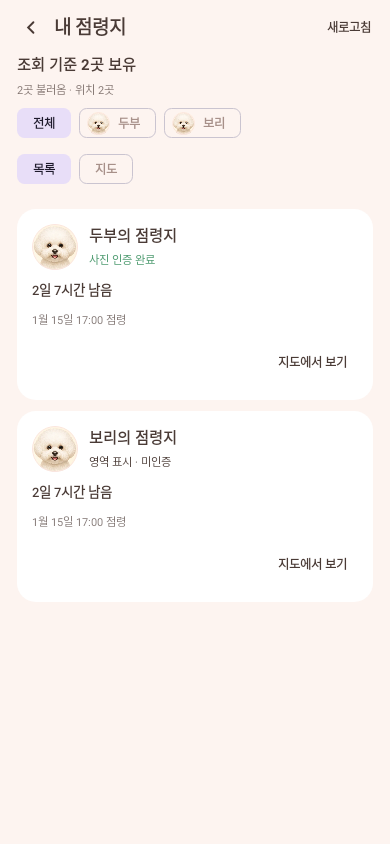

# 내 점령지 목록과 조회 전용 지도 (#270)

`점령 게임 → 점령 지도 보기 → 내 점령지`로 이동한다. 뒤로 가면 강아지 성적 화면으로
돌아온다. 지도에서 시작하고 `목록` / `지도`를 전환할 수 있다. 두 화면은 동일한 회원·강아지
필터와 조회 결과를 사용한다.

## 화면

- `전체`는 로그인 회원의 모든 강아지, 강아지 칩은 그 아이의 현재 점령지만 표시한다.
  서버 대표견이나 산책 참여견은 바꾸지 않는다. 다른 회원의 점령지는 이 목록에 들어오지 않는다.
- 카드에는 등록된 강아지 프로필 사진, 이름, 인증 상태, 점령 시각, 남은 유지 시간을 함께 표시한다.
  사진이 없으면 기존 견종 얼굴/대체 아이콘을 쓴다. 회원·강아지·전봇대 ID는 화면에 출력하지 않는다.
- 목록 카드/`지도에서 보기`를 누르면 실제 전봇대 좌표로 이동하고 같은 카드가 지도 아래에 열린다.
  지도 마커를 눌러도 같은 강아지의 정보가 열린다. `모아보기`는 불러온 좌표 전체를 맞춘다.
- 위치가 없는 항목은 목록에 유지하되 `위치 정보 없음`을 표시하고 지도 이동을 막는다.
  서버에 없는 주소·지명·촬영 위치를 대신 보여주지 않는다.
- 50곳씩 불러온다. 조회 기준 전체 개수, 불러온 개수, 지도에 표시할 좌표 개수를 구분한다.
  다음 페이지가 있으면 목록과 지도 모두 `더 불러오기`를 제공한다. 지도에 일부만 표시한 상태를
  전체 점령지를 다 읽은 것처럼 표시하지 않는다.

## 데이터와 요청 수명

- [DEV #418](https://github.com/SAJOYO/DAENGS_dev/pull/418)의
  `GET /app/territory/my-sites?limit=50[&pet_id=...][&cursor=...]`를 사용한다.
- 공용 SessionProvider로 토큰을 갱신한다. 요청 전후 회원과 refresh token을 검사해 로그아웃,
  회원 전환, 동일 회원 재로그인 사이에 도착한 응답을 폐기한다.
- 화면 진입/포그라운드 복귀와 명시적 새로고침에서 첫 페이지를 다시 읽는다. 필터 변경 시
  이전 목록·커서·선택 위치를 비우며, 목록/지도 표시 방식은 유지한다. 화면 이탈 시 읽기를 취소한다.
- 페이지는 ID로 합친다. 탈취/만료로 페이지 사이의 개수가 변할 수 있고, 이미 지난 ID 구간의
  새 점령지는 새로고침에서 보인다. 반복 커서·조회 실패를 끝 페이지로 바꾸지 않는다.
- 409 `season_changed`는 첫 페이지로 돌아가 다시 읽는다. 첫 페이지도 실패하면 오류를 표시하며
  자동 재시도를 반복하지 않는다. 서로 다른 시즌의 점령지를 합치지 않는다.
- 응답의 `server_now_ms`에 단조 시계 경과를 더해 유지 시간을 표시한다. 만료 시각이 된 항목은
  화면에서 제외한다. 상단 개수는 **서버 조회 기준**이며 다른 사람의 탈취를 실시간 스트림으로
  구독하지 않는다. 새로고침이 현재 소유권을 다시 확인한다. 유지 기한이 null인 기존 데이터는
  `유지 기한 정보 없음`으로 남긴다.
- 로그인 필요/준비 중/활성 시즌 없음/보유 0곳/조회 실패를 구분한다. 추가 페이지 실패 시 이미
  읽은 항목과 재시도 버튼을 유지하지만 인증 오류에서는 이전 목록을 지운다.
- 프로세스나 화면 재생성 시 저장되는 것은 필터·선택·표시 방식이다. 서버 조회 결과를 영구
  저장하지 않으며 복원 후 재조회한다.

## 지도 경계

기존 `MapHost`와 `NaverMapSurface`, 전봇대 아트를 재사용한다. 전용 scene은 현재 점령 마커만
채우고 여러 지역을 볼 수 있도록 축소를 허용한다. 지도 모드일 때만 SDK 화면을 생성한다.
산책 경로·장소 검색·촬영 UI·위치 추적·점령 행동 객체를 생성하지 않는다. GPS 권한이 없어도
서버 좌표로 볼 수 있으며, 이미 진행 중인 산책은 기존 서비스가 계속 담당한다.

이 화면은 현재 점령지 조회다. 수동으로 저장해 소유권을 잃어도 남는 북마크와는 별도이며,
공개 순위·다른 회원 프로필에서 점령지를 보는 흐름은 후속 단계다.

## 배포와 검증

DB·서버 API·게임 스위치·의존성 변경은 없다. backend와 Place에 DEV #418이 모두 반영되어야 한다.
기존 서버 또는 꺼진 게임에서 응답하지 않으면 준비/실패 상태를 표시한다.

대상 테스트는 `OwnedTerritoryApiTest`, `OwnedTerritoryRepositoryTest`, `OwnedTerritoryBrowserTest`,
`OwnedTerritoryScreenTest`, `OwnedTerritoryRouteTest`와 기존 `TerritoryGameScreenTest`, `TerritoryGameRulesTest`다.
API 테스트는 로컬 HTTP stub, UI 테스트는 지도 공급자 대신 scene을 받는 테스트 표면을 사용한다.
실제 Naver SDK 타일·터치와 운영 계정 연결 여부는 이 테스트가 검증하지 않는다.
실행 명령·최종 결과는 PR 본문에 기록한다.

2026-09-10: 최초 6개 클래스 26개 테스트와 debug APK 빌드 통과(3분 52초).
마지막으로 실제 Route의 필터 전환·늦은 응답·로그아웃 통합 테스트 1개와 최종 debug 빌드가
통과했다(1분 8초). 전체 저장소 테스트는 실행하지 않았다.

아래는 가상 데이터로 Robolectric에서 렌더한 목록이다. 운영 계정이나 실기기 캡처가 아니며,
사진을 제공하지 않은 예시라 견종 기본 얼굴을 사용한다.

