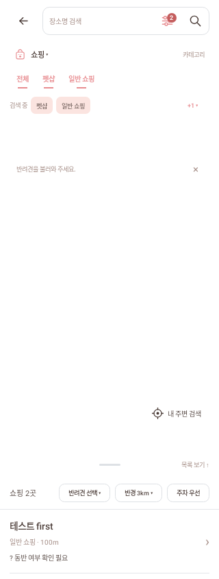
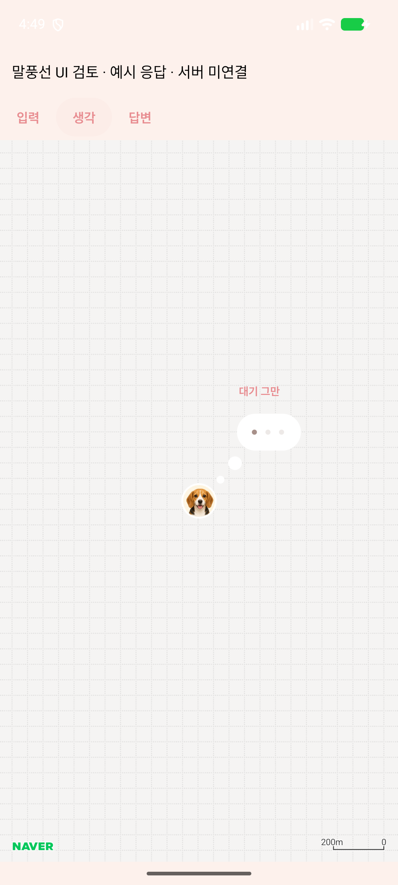
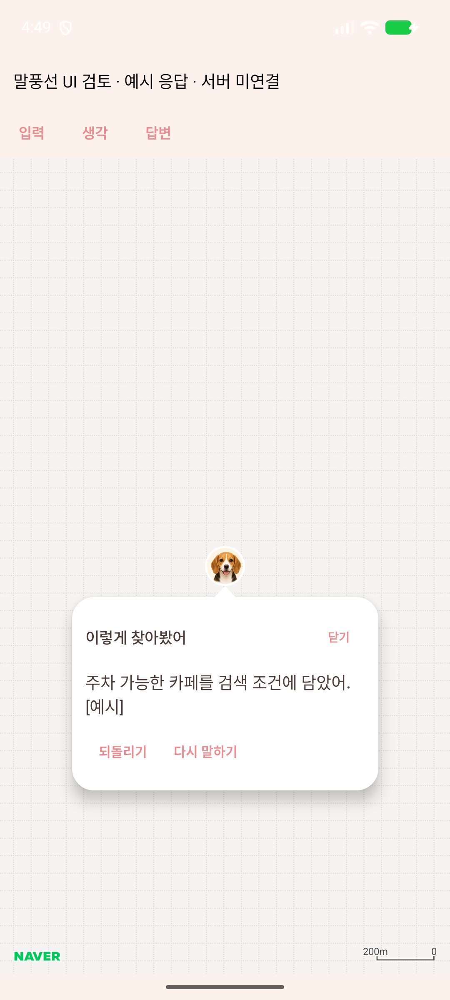
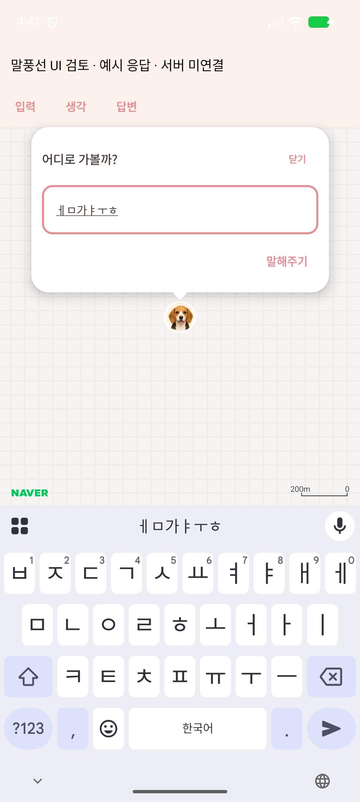

# 지도 위 강아지 말풍선과 검색 조건

PR #256은 기존 대분류/소분류를 유지하면서 카테고리 탐색과 검색 조건 선택을 분리한다.
예를 들어 카페를 담은 채 ‘숙박’을 열어도 검색은 바뀌지 않는다. ‘호텔’을 누르면
카페와 호텔을 함께 검색하고, 같은 이름을 다시 누르면 호텔만 빠진다.

- 대분류 5+4 메뉴는 Popup으로 펼쳐진다. 화면의 지도 높이를 바꾸지 않는다.
- 최상위 ‘전체’의 새 동작은 보류하여 비활성화했다. 각 대분류 안의 ‘전체’는 해당 소분류를 묶어 넣거나 뺀다.
- 소분류는 한 줄에서 글자를 누르고, 선택은 밑줄과 ripple로 표시한다. 많으면 가로로 스크롤한다.
- 검색 큐에는 앞의 두 종류와 나머지 조건 수를 표시한다. 펼친 큐에서도 이름을 눌러 뺄 수 있다.
- 함께 검색할 종류는 서버 계약에 맞춰 최대 6개다. 초과하는 묶음 추가는 전체를 거부한다.
- 마지막 종류를 빼면 빈 선택을 유지하고 요청/결과를 비운다. 카페로 돌아가거나 빈 업종 HTTP를 보내지 않는다.

## 강아지와 입력/응답

지도 SDK의 기존 프로필 사진/견종 그림이 입구다. 얼굴을 별도로 복제하지 않는다.
Naver projection이 준 화면 좌표 위에 터치 영역을 얹고 같은 위치에서 Popup을 배치한다.

입력 말풍선은 최대 340dp, 응답은 최대 280dp다. 머리 아래에 공간이 없으면 위로 옮기고,
가장자리/키보드에 맞춰 높이를 제한한다. 머리에 붙은 꼬리를 기준으로 나타난다.
검색과 설명 생성을 기다리는 동안에는 머리 위의 두 작은 생각 원과 점 세 개를 표시한다.

‘대기 그만’은 앱의 응답 대기를 취소한다. 이미 서버가 처리한 요청까지 취소했다고
주장하지 않는다. 이후 검색은 기존 세션 revision/복구 규칙을 따른다.

상단 입력은 장소명 검색 전용이며, AI 입력은 머리를 눌렀을 때만 연다.
최신 질문과 응답만 표시하고 채팅 기록/장기 메모리는 추가하지 않았다.

## 서버 계약과 두 경로

| 경로 | 표시/적용 방식 |
| --- | --- |
| 기존 facility-discovery-v1 | 서버의 신호와 검색 방향을 말풍선에 표시하고 기존 refine/confirm 동작을 사용한다. 제안/오류/재요청 동안 이전 확정 목록을 유지한다. |
| facility-conversation-v2 | 서버가 확정한 필터/목록을 먼저 적용하고 이후 answer 응답을 말풍선에 표시한다. 필수 조건은 큐/필터창에서 확인한다. |

명확한 명령의 적용 여부, 모호하거나 미지원인 조건의 확인은 기존 서버 정책에 맡긴다.
앱에는 문장 정규식 분류나 가짜 LLM 응답을 넣지 않는다.

v2에서 마지막 AI 응답이 필터를 실제로 변경하고 결과까지 일치할 때 한 번 되돌리기를
제공한다. 기존 restore 계약에 직전 filters 전체를 보내 서버에서 다시 검색한다.
성공 전까지 현재 조건/결과를 유지하며, 실패 재시도에는 같은 요청 ID를 사용한다.
직접 검색/프로필 변경 이후에는 이전 되돌리기를 폐기하고 늦은 응답을 차단한다.
취소된 undo는 새 세션을 만드는 복원이므로 이후 수동 검색에서 재생하지 않는다.

직접 필터 해제는 앱 #247의 커밋 `1c2f0bf`를 포함한다.
서버 [#389](https://github.com/SAJOYO/DAENGS_dev/pull/389)의 filters 모드가 필요하다.
#247 및 서버 #389는 이 작업 시점에 아직 병합되지 않았다.

활성화 설정은 바꾸지 않는다. v2는 debug에서 `-PfacilityConversation=true`일 때만
켜지며 release는 기존 v1 경로다. v1은 확정된 검색 방향을 직접 카테고리 검색으로
바꾸면 그 방향을 해제하는 기존 계약이며, v2와 같은 필수 조건 편집 계약이 아니다.

## 검증

기능별 선택자는 [테스트 실행 지도](../app/src/test/README.md)에 있다.
첫 실행은 변경 경계의 16개 클래스/80개 항목을 통과했다. 말풍선 전환 검증을 추가한 뒤
최종 UI/대화 8개 클래스/36개 항목, 마지막 검색 방향 큐 수정은 연결 화면 2개 클래스로
재검증했다. 중복을 제외한 검증 항목은 81개다. 전체 테스트는 실행하지 않았다.

Debug에만 `PlaceDogBubbleLabActivity`를 추가했다. **예시 응답 · 서버 미연결**을
명시하며 실제 Naver MapView의 projection, 머리 터치, 입력, 생각, 답변, 키보드를 확인한다.

```powershell
adb shell am start -n com.daengs.app/com.daengs.app.ui.places.lab.PlaceDogBubbleLabActivity
```

에뮬레이터 검토 APK는 로컬 init script로 별도 패키지 `com.daengs.app.dogbubbles`에
설치했다. 저장소의 applicationId는 변경하지 않는다. 설치 출력의 Success를 확인했다.
지도 키가 없는 환경이므로 타일은 빈 격자로 표시되지만 실제 SDK의 아바타/projection은 동작한다.

실물 폰, 로그인한 실제 LLM/filters 서버, 회전/접근성 글자 배율은 별도 확인 범위다.
에뮬레이터의 예시 응답을 실제 서버 응답 검증으로 세지 않는다.

아래 말풍선 이미지는 에뮬레이터의 실제 SDK/Compose 화면이며 응답은 검토용 예시다.
검색 큐 이미지는 Robolectric의 320dp 합성 화면이다.

| 검색 큐 (합성) | 생각 (에뮬레이터) | 응답 (에뮬레이터) | 키보드 (에뮬레이터) |
| --- | --- | --- | --- |
|  |  |  |  |
