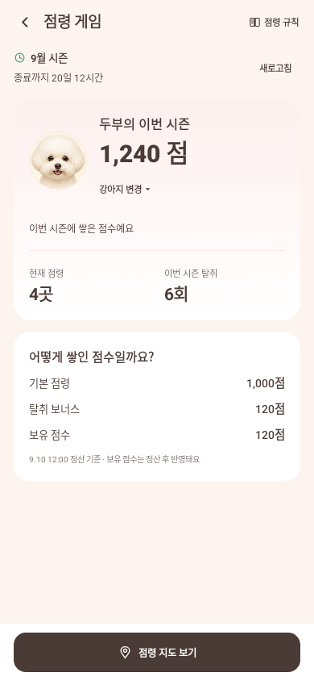
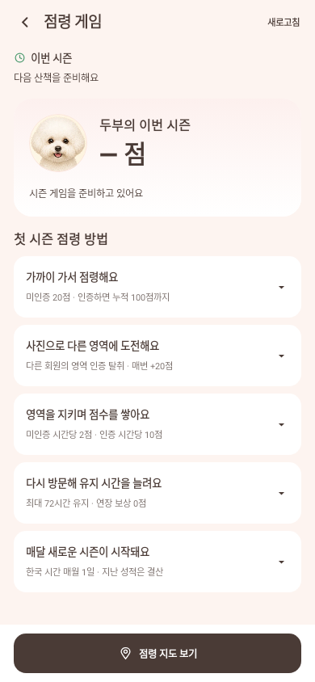
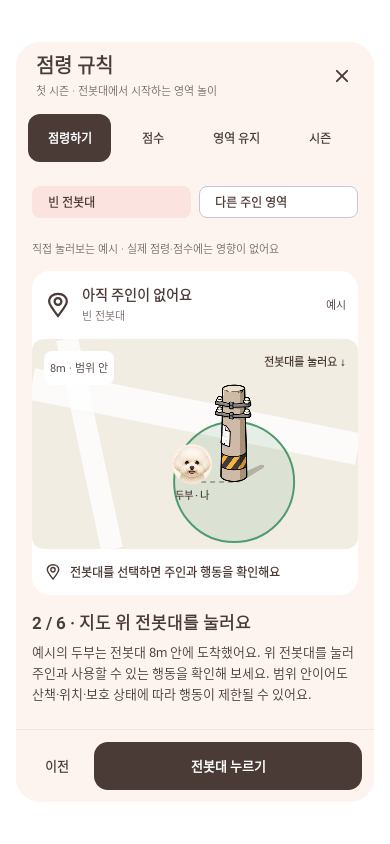
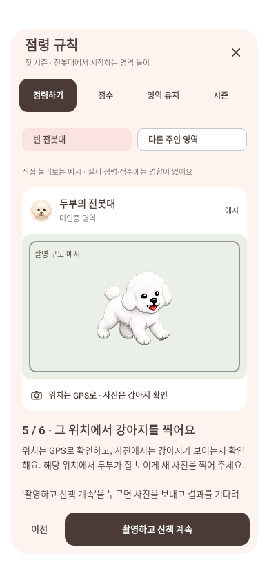
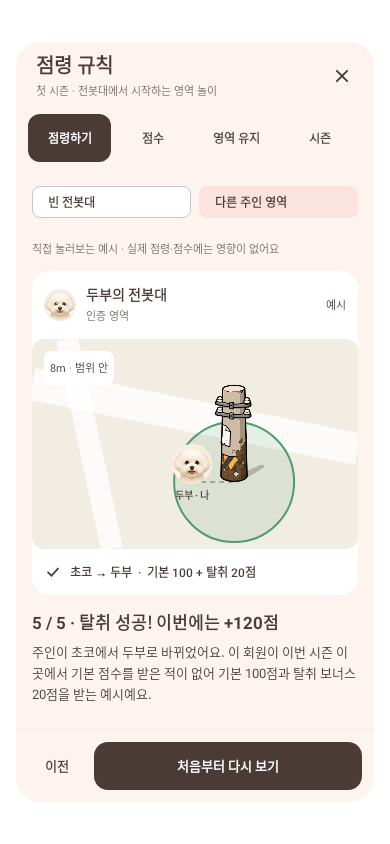
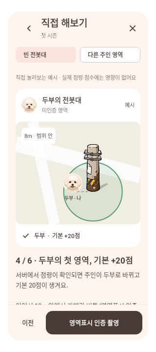

# 점령 게임 화면 (#260)

홈 하단 시즌 안내에서 전용 점령 게임 화면으로 진입한다. 구성은 상단 바, 시즌 안내, 강아지 성적, 점수 내역, 하단 지도 버튼이다. 상단의 `점령 규칙` 버튼에서 별도 팝업을 연다.

## 데이터와 표현

- 기존 activity의 현재 시즌/강아지별 점령 요약을 읽는다. DB·API·게임 플래그를 바꾸지 않는다.
- 강아지 얼굴은 PetAvatar에 기존 PetPhotoHolder의 프로필 사진을 전달한다. 사진이 없을 때만 견종 얼굴, 알려진 견종도 없으면 발자국을 쓴다.
- 조회할 강아지 선택은 이 화면의 상태다. 서버 대표견이나 진행 중 산책의 참여견을 바꾸지 않는다.
- 회원과 선택 강아지가 바뀌면 표시 상태를 새로 만들고 이전 요청 결과를 분리한다. 로그인/프로필 없음/조회 실패/시즌 없음/준비 중/집계 중을 구분한다.
- 점수 응답 자체가 0이면 그대로 표시한다. 점수 응답이 없을 때는 정상 요약에서 점령 이력 0을 확인한 경우만 0점을 표시한다. 미처리 응답과 실패를 임의의 0점으로 바꾸지 않는다.
- 기본 점령·탈취 보너스·보유 점수와 정산 기준 시각을 보여준다. 구 시즌에서 분리 점수가 없으면 합산 보상만 표시한다. 현재 순위를 추정하지 않고 final_rank가 제공될 때만 최종 순위를 표시한다.
- 남은 시간은 server_now_ms에 응답 이후 단조 시계 경과를 반영한다. 한국 시간으로 시즌을 표시하고 화면이 보일 때만 30초마다 재조회한다.

## 규칙

DEV #396/#400/#403의 첫 시즌 계약을 설명한다. 회원·장소·시즌 기본 한도 100점과 행동한 강아지에게 귀속되는 점수를 구분한다. 미인증 20점, 인증 차액, 다른 회원의 영역 인증 탈취 +20점, 미인증/인증 시간당 2/10점, 인증 보호 10분, 최대 72시간 유지, 연장 0점, 월간 시즌을 포함한다.

- 팝업은 점령하기 / 점수 / 영역 유지 / 시즌 탭으로 나눈다. 제목·닫기·탭·하단 행동은 고정하고 내용만 스크롤한다. 뒤로 가기나 닫기는 성적 화면으로 돌아온다.
- 점령하기는 지도 전봇대 그림과 범위 색을 재사용하는 로컬 예시다. 전봇대는 점령 위치를 나타내는 아이콘이다. 주인과 점수는 가상의 두부/초코이며, 예시라는 문구를 항상 표시한다. 로그인·게임 활성화 없이도 읽을 수 있다.
- 빈 전봇대: 접근 → 전봇대 선택 → 영역표시 → 두부 소유/+20 → 인증 촬영 구도 → 인증 성공/+80, 기본 누적 100점.
- 다른 주인 영역: 접근 → 초코의 전봇대 선택 → 인증 촬영 → 인증 성공/두부 소유. 처음 방문한 회원의 기본 100 + 탈취 20점 예시이며, 이미 기본 20/100점을 받은 경우의 보상 차이도 설명한다.
- 실제 지도와 같은 `영역표시`, `영역표시 인증 촬영`, `촬영하고 산책 계속` 문구를 쓴다. 전봇대 그림도 직접 누를 수 있고 하단 버튼으로 같은 단계를 진행할 수 있다.
- 인증 위치는 GPS로, 강아지가 보이는지는 사진으로 확인한다. 촬영 프레임에는 비숑 그림만 보여주고 지도 전봇대 아이콘은 표시하지 않는다. 해당 위치에서 강아지가 잘 보이게 새로 촬영하도록 실제 카메라 안내도 맞췄다. 예시에서는 실제 카메라·위치·산책·점령 API를 실행하지 않으며, 실제 성공은 서버 인증 후 확정된다는 설명을 포함한다.
- 이전/처음부터/예시 전환을 지원한다. 회전·상태 복원 시 열린 팝업과 탭·예시 단계가 복원된다. 닫았다가 새로 열면 첫 설명부터 시작한다.

## 지도 연결

지도 버튼은 [내 점령지 전용 지도와 목록 (#270)](owned-territory-browser.md)을 연다. 여기서 뒤로 가면 게임 화면으로 돌아오고, 조회 강아지 선택과 성적 스크롤 위치는 복원한다. 산책 중에도 같은 조회 화면을 열며 산책 시작/정지/참여견 변경 명령을 보내지 않는다. 실제 점령·촬영은 홈의 산책 진입을 사용한다.

## 검증

최초 화면 검증: 고유 대상 테스트 50개(activity 20개 + game/WalkViewModel 30개) 통과, debug APK 빌드 성공. 화면 상태 복원, 강아지/계정 변경 뒤 이전 성적 제거, 시간 계산, 준비/집계/실패/0점 구분, 산책 세션·참여견 유지를 확인했다.

2026-09-10 팝업 보완: `TerritoryGameScreenTest` 4개와 `TerritoryGameRulesTest` 3개, 총 7개가 실패/건너뜀 없이 통과했다. 최종 debug APK 빌드 성공(3분 38초). 두 점령 예시, 전봇대 터치, 사진 구도, 점수 차액, 예시 전환·이전·처음부터, 닫기/시스템 뒤로, 상태 복원과 320dp·글자 1.3배를 검증했다. 팝업의 별도 저장소 때문에 초기화되던 탭/단계는 호출 화면의 저장 상태로 이동해 복원 검증까지 통과했다.

촬영 조건 안내 보완: `TerritoryGameRulesTest` 3개, 작은 화면 1개, 온라인 촬영 안내 1개, 총 5개 통과(실패/건너뜀 0). debug APK 빌드 성공(41초). 촬영 단계에 지도 오브젝트가 없고 강아지만 표시되는 것을 확인했다.

실행 명령은 PR 본문에 기록한다. 전체 저장소 테스트는 실행하지 않았다. 실제 GPS·카메라·서버 플레이는 실기기 후속 검증이다.

### 화면 예시

Robolectric에서 예시 데이터로 렌더한 화면이다. 운영 성적이나 실제 기기 화면이 아니다. 성적 예시 얼굴은 사진이 없을 때의 비숑 기본 얼굴이며, 실제 성적 화면은 등록된 프로필 사진을 우선한다. 규칙 속 두부/초코는 고정된 예시 강아지이고, 팝업 캡처는 팝업 창만 렌더한 것이다.

내 점령지 목록·지도는 [#270](owned-territory-browser.md)에서 연결한다. 순위 목록, 다른 회원의 점령지, 북마크·알림은 후속 범위다.
