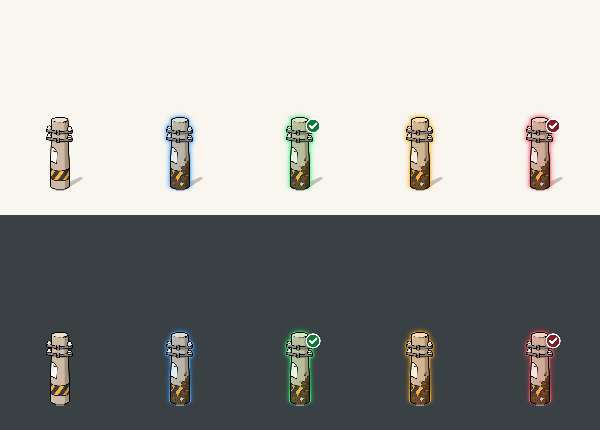

# 점유 상태별 전봇대 그림

굵은 외곽선과 단순한 명암의 코믹 전봇대를 사용한다. 기본과 점유 그림은 같은 실루엣이며 점유 상태만 밑동에 큰 갈색 얼룩을 표시한다. 살짝 비스듬한 시점, 짧은 금속 가로대, 왼쪽의 해진 흰 포스터를 유지한다. 지도에서 장소 간 여백이 보이도록 본체를 이전의 65%로 줄이고, 짧고 뭉뚝한 사선 고깔 그림자를 붙인다.

| 상태 | 에셋 | 고정 상태 표시 | 지도 문구 |
| --- | --- | --- | --- |
| NEUTRAL | map_territory_pole_neutral.webp | 기본 그림자만 | 선택하면 기존 장소/점유 설명 |
| 내 UNVERIFIED | map_territory_pole_occupied.webp | 본체 파랑 형광빛 | 내 미인증 |
| 내 VERIFIED | map_territory_pole_occupied.webp | 본체 초록 형광빛 + 흰 체크 배지 | 내 인증 |
| 상대 UNVERIFIED | map_territory_pole_occupied.webp | 본체 주황 형광빛 | 상대 미인증 |
| 상대 VERIFIED | map_territory_pole_occupied.webp | 본체 빨강 형광빛 + 흰 체크 배지 | 상대 인증 |

`WalkMapPresentation`의 점유 상태와 서버 회원 소유 플래그 `isOwnedByMe`를 사용한다. 선택한 강아지나 이름이 달라도 같은 회원의 점령지는 내 색으로 표시한다. 내 점령지 전용 조회는 `isMine=true`이며, 점유 정보가 없는 북마크는 중립 표시를 유지한다. 더러움은 점유 유무를 뜻하며 시간이나 방문 횟수에 따라 누적하지 않는다. 미인증과 인증은 같은 원본 에셋에 형광 윤곽과 부드러운 색빛을 합성한다. 본체는 원래 질감과 색을 유지하고 약한 반사색만 더한다. 바닥 타원 발광은 사용하지 않는다. 인증에는 색 구분을 보완하는 체크도 붙인다. 선택하지 않아도 상태가 보이며 기존 caption과 카드도 유지한다. 상태 발광은 실제 판정 반경을 뜻하지 않는다. 접근 링과 잠깐 나타나는 성공 발자국은 기존 반경·시간·색상을 유지한다.

## 에셋과 배치

- 내장 image_gen 도구로 이 작업의 승인된 시안을 편집했다. 외부 에셋 팩이나 외부 저장소 그림이 아니다.
- 승인 시안: `exec-42c46267-8c7d-4eb3-b2d5-6280991bdbf1.png`.
- 기본 원본: `exec-44ccda44-acd7-4bbc-90a4-4eef4060e286.png`.
- 점유 원본: `exec-a63ba3cd-abe0-464f-bd57-38bb7f116700.png` (기본 이미지를 편집해 밑동 얼룩 추가).
- 두 원본 모두 RGBA다. 원본 알파를 보존하며 alpha ≤ 16인 거의 투명한 잡음은 크기/밑동 측정에서 제외한다. 흰 포스터·애자는 지우지 않는다. 기존 불투명 매트 입력도 계속 지원한다.
- 원본은 작업 드롭 폴더의 `map/territory_pole_{neutral,occupied}.png`에 보관했다. 앱은 저장소의 WebP만 사용하므로 생성 도구의 로컬 경로에 의존하지 않는다.
- 반입: `uv run tools/import_room_assets.py <drop>` → `map_sprite.py` → 기존 WebP 품질 92. 기존 방·견종 반입 동작은 유지한다.
- 두 파일 모두 **256×640**, 밑동 접점 **(128,624)**. 바깥 배경을 자른 뒤 밑면 중심을 맞추므로 가로대가 좌우 중심을 바꾸어도 밑동은 움직이지 않는다.
- 네이버 마커는 선택 전후 모두 **48×120px**이며 준비 효과에서도 확대하지 않는다. 선택은 범위 원·caption·카드로 표현한다. 내부 본체만 밑동을 중심으로 **65%** 축소하며 실제 높이는 약 **73px**다. 점령 성공 확대는 가로·세로를 함께 키운다. anchor는 **(0.5,0.975)**라 성공 효과에서도 밑동의 지리 좌표가 유지된다. 선택 시 카메라 줌인은 추가하지 않는다.
- 그림자는 에셋에 굽지 않고 `territoryMarkerIcon`에서 오른쪽 위로 짧게 뻗는 둥근 끝의 고깔 Path로 그린다. 팔 모양이나 원형 받침이 없고 두 상태 모두 같은 색/알파(76/255, 약 30%)다. 작은 그림자 뒤에 본체를 합성한다.
- 발광은 전봇대의 알파 실루엣을 따라 넓은 상태별 형광빛, 좁은 색빛, 밝은 심지를 합성한다. 본체 반사색은 약 12%만 더해 페인트처럼 덮지 않는다. 그림자에는 조명 필터를 적용하지 않고 밑동 쪽 빛은 투명하게 줄여 캔버스 끝에서 잘리지 않게 한다. 인증 체크는 흰 테두리와 해당 상태색을 어둡게 한 바탕으로 밝고 어두운 지도에서 구분한다. 기존 비트맵의 투명 여백에 합성하므로 전체 크기·밑동 접점은 바뀌지 않는다. 지속 애니메이션이나 추가 지도 오버레이는 없다.
- 합성 비트맵 **다섯 개를 회원 소유·점유 상태 조합별로 캐시**하며 애니메이션 프레임마다 비트맵을 만들지 않는다. 원본 파일은 두 개지만 회원 소유·미인증·인증의 합성 결과가 다르므로 리소스 ID로 캐시를 합치지 않는다. 지도·`TerritoryFeedbackPreview`·규칙 팝업 예시가 같은 합성 함수를 사용한다.

## 검토 방법

`TerritoryFeedbackPreview`는 지도와 같은 픽셀 크기/접점을 사용한다. `TerritoryPoleArtTest`는 실제 WebP를 읽어 배경 alpha, 흰 포스터 보존, 밑동 명도 차이, 비율을 검증하고 `app/build/reports/territory-pole/native-sizes.png`를 출력한다. 이 그림은 실제 크기 래스터 비교이며 지도 스크린샷은 아니다.

Debug 빌드의 `TerritoryPoleLabActivity`는 실제 `MapHost`와 전봇대 레이어에 가상 장소 다섯 개를 전달한다. 가운데 미점유, 위쪽 내 미인증·인증, 아래쪽 상대 미인증·인증을 배치한다. 가운데 상태 전환 버튼은 다섯 조합을 순환한다. 소유·인증 색, 선택 전후 크기 유지, 상태 전환, 링/발자국을 서버 점령이나 GPS 기록 없이 검토한다. 빈 바닥을 누르면 선택과 범위 표시를 해제한다. 이 진입점은 release에 포함되지 않는다.

```powershell
adb shell am start -n com.daengs.app/.ui.walk.TerritoryPoleLabActivity
```

원본 반입 당시 검증: `uv run --with pillow python -m unittest discover -s tools -p test_map_sprite.py` 4개, `:app:testDebugUnitTest --tests '*TerritoryPoleArtTest' --tests '*TerritoryFeedbackUiTest'` 9개 통과. `:app:assembleDebug -PterritoryServerRead=true` 성공. 지도 키/API 주소는 ignored 로컬 설정이며 저장소에는 넣지 않는다. 에뮬레이터 설치 `Success` 후 APK를 회수해 두 WebP의 SHA-256 일치를 확인한다. 실화면 검증 결과는 PR에 기록하며, 물리 기기와 로그인 뒤 실제 점유 조회는 별도다.

회원별 네 가지 형광 표현은 `TerritoryPoleArtTest` 6개, 회원 소유 매핑은 `TerritoryBoardPresentationTest` 9개와 `OwnedTerritoryBrowserTest`의 지도 장면 1개, 규칙 예시는 `TerritoryGameRulesTest` 3개로 검증했다(총 19개). 이전 변경의 빈 바닥 탭 해제는 `OwnedTerritoryScreenTest` 4개·`TerritoryBookmarksScreenTest` 5개와 `WalkViewModelTest`의 저장 중 카드 해제 1개로 검증했다. 최신 별도 미리보기 APK를 실기기에 설치하고 회수한 APK의 SHA-256 일치, 선택 전 네 가지 색상·인증 체크와 내 인증 선택 → 바닥 탭 → 범위 해제를 확인했다. 가상 장소를 사용했으며 실제 점령 API는 호출하지 않았다.

아래는 현재 실제 표시 픽셀 크기의 합성 결과다. 왼쪽부터 미점유·내 미인증(파랑)·내 인증(초록)·상대 미인증(주황)·상대 인증(빨강)이다. 위는 밝은 배경, 아래는 어두운 배경이다. 선택 전후 크기는 동일하다.


