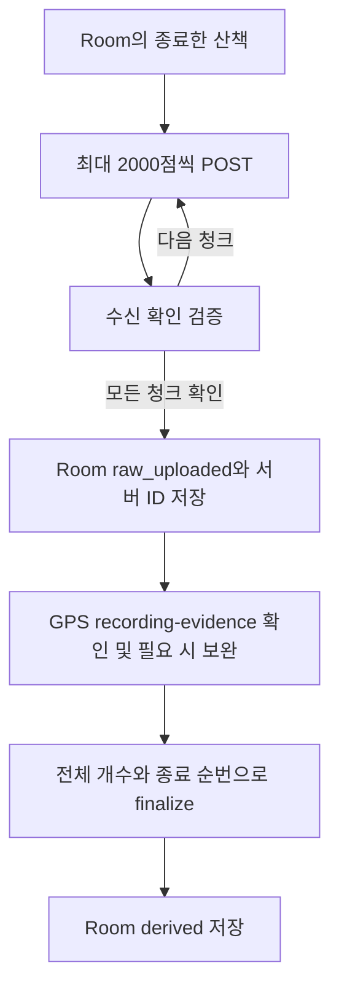

# 산책 업로드 수신 확인

APP은 산책 생성과 좌표 추가에 `?response=receipt-v1`을 붙인다. 서버가 누적 전체 경로 대신
이번 요청의 저장 결과만 반환하므로, 긴 산책에서 청크가 쌓일수록 응답이 커지는 비용을 줄인다.
대응 계약은 [DEV #478](https://github.com/SAJOYO/DAENGS_dev/pull/478)의
[수신 확인 v1](https://github.com/SAJOYO/DAENGS_dev/blob/89cc75484bdfdcd063983f5c06515420c5107a1b/docs/walk/upload-receipts.md)이다.



## 응답을 확인하는 기준

`WalkHttpApi`가 HTTP를 처리하고 `WalkUploadReceipt`가 다음을 검증한다.
앱의 기본 `WalkApi`는 BuildConfig의 서버 주소를 사용하는 인스턴스다.

| 항목 | 확인 |
| --- | --- |
| 계약 버전 | `walk-upload-receipt-v1` |
| 식별자 | 유효한 UUID인 `walk_id`, 요청의 `client_session_id`, 이미 아는 서버 ID와 일치 |
| 청크 | 이번 요청의 `seq_from`, `seq_to`, `point_count`와 일치, 정수 타입 |
| 결과 | `stored` 또는 `replayed` |
| 좌표 없는 생성 | 필드가 명시적으로 `chunk: null`이어야 함 |

`point_count`는 누적 개수가 아니다. 빈 생성의 `chunk:null`도 서버 전체 경로가 비었다는 뜻이
아니다. 원본 전체의 완결성은 기존 finalize manifest가 검사한다. 요청 body·청크 크기·
상세 GET·finalize 경로·Room 스키마는 유지한다.

## 구형 서버와 실패 처리

- 구형 서버가 query를 무시하면 `id`·`client_session_id`·`points`를 가진 상세 응답으로
  처리한다. 누적 좌표에서 이번 요청의 순번을 찾아 중복·누락·원본 내용 불일치를 검사한다.
  좌표 소수 여섯 자리와 시각 밀리초의 기존 저장 정밀도로 대조한다.
- 구형 응답의 `recording_eligible`이 unknown이면 기존 GPS 증거 확인/보완 단계가 판단한다.
  로컬·서버 양쪽에서 알려진 값이 서로 다르면 확인 실패다. GPS 지원 필수 여부는 기존
  `requireRecordingSupport` 정책을 유지한다.
- 버전이 없거나 틀린 새 응답을 구형 상세로 해석하지 않는다. HTTP 401·403·409·422·5xx에도
  다른 POST를 자동 재발송하지 않으며, 기존 호출자에게 실패를 전달한다.
- 청크 응답 유실·검증 실패 시 `raw_uploaded`로 표시하지 않는다. 다음 실행은 동일 세션 ID와
  동일 청크를 다시 보내고, 서버의 `replayed`를 확인한 뒤 진행한다. 청크별 재개 지점은 저장하지 않는다.
- 모든 청크를 확인한 뒤 finalize 응답만 잃었다면 저장된 서버 ID로 GPS 확인·finalize부터 재시도한다.
  서버의 기존 analysis 재사용 계약을 사용한다.
- 생성·청크·봉인 응답 후 계정을 재확인한다. 계정 변경 시 다음 청크나 로컬 완료 표시로 진행하지 않는다.
  조용한 주기 동기화에서도 코루틴 취소는 전파한다.

## 검증

저장소 루트에서 실행한다. Docker·외부 API·CI가 필요하지 않다.

```powershell
.\gradlew.bat :app:assembleDebug :app:testDebugUnitTest `
  --tests 'com.daengs.app.walk.sync.WalkUploadReceiptTest' `
  --tests 'com.daengs.app.walk.sync.WalkUploadHttpTest' `
  --tests 'com.daengs.app.walk.sync.WalkUploadSyncTest' `
  --tests 'com.daengs.app.walk.sync.WalkSyncTest' `
  --tests 'com.daengs.app.walk.sync.WalkRecordingSyncTest' `
  --tests 'com.daengs.app.walk.sync.WalkMotionSyncTest' `
  --tests 'com.daengs.app.walk.store.WalkDaoTest' --max-workers=2 --console=plain
```

HTTP 테스트는 loopback 소켓에서 실제 `HttpURLConnection`의 URL·본문·응답·오류를 검사한다.
Room 테스트는 잘못된 청크 응답을 받은 경우, 새 동기화 인스턴스의 재전송, GPS 확인과 봉인 순서,
봉인 응답 유실 후 재시도를 확인한다. 서버는 이 테스트에서 대역이며, 실제 DEV DB의 저장·동시성
검증은 DEV #478에 있다. 실기기·실제 배포 서버 간 통신과 전송량 측정은 별도 검증 범위다.
